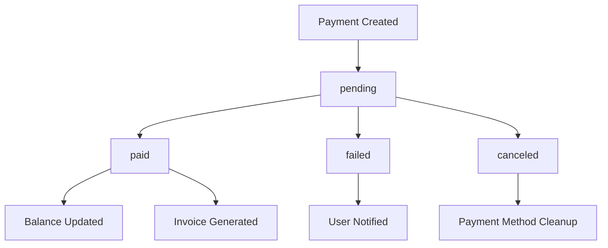
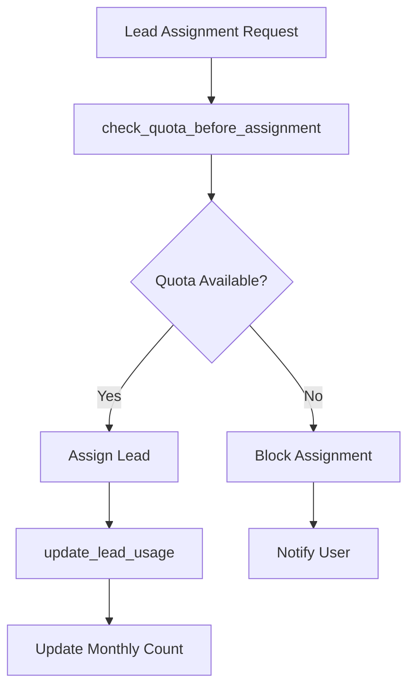

# GS Lead Platform - Consistency Analysis Report

**Senior Tech Lead Analysis**  
**Date:** January 2025  
**Scope:** Platform consistency with canonical UI for `/dashboard/payments` (Customer) and `/admin/payments` (Admin)

---

## 📋 Executive Summary

This comprehensive analysis examines the GS Lead Platform's current state against canonical payment interfaces, identifying critical inconsistencies in design tokens, database security, payment flows, and user experience patterns. The platform shows a hybrid architecture with both EJS and React/Next.js components, requiring systematic alignment to establish consistent design patterns and security standards.

**Key Findings:**
- ✅ **Strong Foundation**: Well-structured codebase with comprehensive authentication and payment processing
- ⚠️ **Design Token Fragmentation**: Scattered styling across inline styles and CSS files
- 🚨 **RLS Security Gaps**: Inconsistent row-level security policies requiring hardening
- 🔄 **Payment Flow Issues**: Classic webhook implementation with partial idempotency
- 📊 **UI Inconsistencies**: Mixed loading states and error handling patterns

---

## 🏗️ Architecture Summary

### Technology Stack
```json
{
  "frontend": {
    "primary": "EJS templating with Express.js",
    "secondary": "React/Next.js components",
    "styling": "Tailwind CSS + custom CSS",
    "charts": "Recharts + Chart.js"
  },
  "backend": {
    "framework": "Express.js",
    "database": "PostgreSQL via Supabase",
    "auth": "Supabase Auth",
    "payments": "Mollie API"
  },
  "key_dependencies": [
    "@supabase/supabase-js",
    "@mollie/api-client", 
    "recharts",
    "@radix-ui/react-*",
    "tailwindcss"
  ]
}
```

### Project Structure
```
gs-lead-platform/
├── app/                    # Next.js app directory
├── components/             # React components
├── views/                  # EJS templates
├── routes/                 # Express routes
├── middleware/             # Auth & permissions
├── services/              # Business logic
├── public/css/            # Stylesheets
├── supabase/              # Database config
└── migrations/            # SQL migrations
```

---

## 🎨 Design System Snapshot (Canonical)

### Primary Design Tokens
**Source:** `public/css/admin/adminPayments.css` (lines 1-30)

| Token | Value | Usage | Status |
|-------|-------|-------|--------|
| `--primary-color` | `#ea5d0d` | Primary buttons, accents | ✅ Canonical |
| `--primary-hover` | `#c24c0b` | Hover states | ✅ Canonical |
| `--success-color` | `#10b981` | Success states | ✅ Canonical |
| `--danger-color` | `#ef4444` | Error states | ✅ Canonical |
| `--text-primary` | `#111827` | Headings | ✅ Canonical |
| `--text-secondary` | `#4b5563` | Body text | ✅ Canonical |
| `--border-color` | `#e5e7eb` | Borders | ✅ Canonical |
| `--radius-md` | `0.375rem` | Card radius | ✅ Canonical |
| `--shadow-md` | `0 4px 6px -1px rgba(0,0,0,0.1)` | Cards | ✅ Canonical |

### Typography System
**Font Stack:** `-apple-system, BlinkMacSystemFont, 'Segoe UI', Roboto, sans-serif`

| Element | Size | Weight | Color |
|---------|------|--------|-------|
| Page Title | `20px` | `600` | `#111827` |
| Card Title | `18px` | `500` | `#111827` |
| Body Text | `14px` | `400` | `#4b5563` |
| Small Text | `12px` | `500` | `#9ca3af` |

### Component Patterns

#### Cards
```css
.card {
  background: #ffffff;
  border: 1px solid #e5e7eb;
  border-radius: 0.375rem;
  box-shadow: 0 1px 2px 0 rgba(0, 0, 0, 0.05);
  padding: 24px;
}
```

#### Buttons
```css
.btn-primary {
  background: #ea5d0d;
  color: white;
  border-radius: 0.375rem;
  padding: 8px 16px;
  font-weight: 500;
  transition: all 0.2s ease;
}
```

### Design Token Issues
- **Fragmentation**: Tokens scattered across 4+ CSS files
- **Inconsistency**: Inline styles override CSS variables
- **Missing States**: Loading, empty, error states not standardized
- **Recommendation**: Centralize in `design-tokens.css` + Tailwind config

---

## 🗺️ Route & Feature Map

### Customer Routes (`/dashboard/*`)

| Route | Role | Status | Features | File Path |
|-------|------|--------|----------|-----------|
| `/dashboard` | `authenticated` | ✅ Complete | Leads overview, charts, stats | `routes/dashboard.js:1-144` |
| `/dashboard/payments` | `authenticated` | ✅ Complete | Payment history, methods | `routes/dashboard.js:400-500` |
| `/dashboard/leads` | `authenticated` | ✅ Complete | Lead management, filters | `routes/dashboard.js:146-307` |
| `/dashboard/leads/:id` | `authenticated` | ✅ Complete | Lead details, actions | `routes/dashboard.js:310-400` |

### Admin Routes (`/admin/*`)

| Route | Role | Status | Features | File Path |
|-------|------|--------|----------|-----------|
| `/admin` | `admin` | ✅ Complete | Dashboard overview | `routes/admin.js:1-50` |
| `/admin/payments` | `admin` | ✅ Complete | All payments, KPIs | `routes/admin.js:100-200` |
| `/admin/leads` | `admin` | ✅ Complete | Lead management | `routes/admin.js:200-300` |
| `/admin/users` | `admin` | ✅ Complete | User management | `routes/admin.js:300-400` |

### API Routes (`/api/*`)

| Route | Role | Status | Features | File Path |
|-------|------|--------|----------|-----------|
| `/api/webhooks/mollie` | `public` | ✅ Complete | Payment webhooks | `routes/webhooks.js:1-100` |
| `/api/payments/*` | `authenticated` | ✅ Complete | Payment operations | `routes/payments.js` |
| `/api/admin/kpi-data` | `admin` | ✅ Complete | KPI data with date ranges | `routes/admin.js:50-100` |

### Middleware Stack
```javascript
// Authentication Flow
app.use("/dashboard", requireAuth, dashboardRoutes)
app.use("/admin", requireAuth, isAdmin, adminRoutes)

// Middleware Files:
// - middleware/auth.js: requireAuth, isAdmin
// - middleware/permissions.js: granular permissions
```

---

## 🗄️ Database & RLS Map

### Core Tables Analysis

#### `payments` Table
**RLS Status:** ✅ Enabled  
**Policies:**
- `admin_all_access`: Admins have ALL privileges
- `users_insert_own`: Users can INSERT own payments (`WITH CHECK (auth.uid() = user_id)`)
- `users_select_own`: Users can SELECT own payments

**Security Assessment:** ✅ **SECURE**
- Proper user isolation
- Admin override available
- WITH CHECK constraints present

#### `invoices` Table  
**RLS Status:** ✅ Enabled  
**Policies:**
- `admin_all_access`: Admins have ALL privileges
- `users_select_own`: Users can SELECT own invoices

**Security Assessment:** ⚠️ **PARTIAL**
- Users cannot INSERT invoices (good)
- Missing UPDATE policy for users
- No WITH CHECK on SELECT policy

#### `profiles` Table
**RLS Status:** ✅ Enabled  
**Policies:**
- `public_insert_own`: Users can INSERT own profile (`WITH CHECK (auth.uid() = id)`)
- `public_select_own`: Users can SELECT own profile
- `public_update_own`: Users can UPDATE own profile (`WITH CHECK (auth.uid() = id)`)
- `service_role_all`: Service role has full access

**Security Assessment:** ✅ **SECURE**
- Proper ownership validation
- Service role access for system operations

#### `lead_usage` Table
**RLS Status:** ✅ Enabled  
**Policies:**
- `authenticated_all`: Authenticated users have ALL access (`WITH CHECK true`)
- `service_role_all`: Service role has full access
- `users_select_own`: Users can SELECT own usage

**Security Assessment:** 🚨 **CRITICAL ISSUE**
- `WITH CHECK true` allows users to modify ANY lead usage
- Should be `WITH CHECK (auth.uid() = user_id)`

### Critical RLS Issues

1. **`lead_usage` Policy Vulnerability**
   ```sql
   -- CURRENT (VULNERABLE)
   CREATE POLICY "authenticated_all" ON lead_usage FOR ALL 
   TO authenticated WITH CHECK true;
   
   -- SHOULD BE
   CREATE POLICY "authenticated_all" ON lead_usage FOR ALL 
   TO authenticated WITH CHECK (auth.uid() = user_id);
   ```

2. **Missing WITH CHECK on SELECT Policies**
   - `invoices.users_select_own` lacks WITH CHECK
   - `payment_methods.users_select_own` lacks WITH CHECK

3. **Index Performance Issues**
   - Missing composite indexes on frequently queried columns
   - `payments(user_id, status)` exists but could be optimized

### Database Functions & Triggers

#### Critical Functions
- `can_allocate_lead()`: Quota validation before lead assignment
- `check_quota_before_assignment()`: Trigger function for quota enforcement
- `update_lead_usage()`: Updates usage statistics on lead status changes
- `should_block_user_for_status_change()`: Payment validation for status changes

#### Trigger Analysis
- `trg_check_quota_before_assign`: Prevents quota violations
- `update_lead_usage`: Maintains usage statistics
- `set_lead_price_at_purchase`: Sets pricing on lead acceptance

---

## 💳 Payment & Quota Flows

### Mollie Webhook Implementation

**Endpoint:** `POST /api/webhooks/mollie` (`routes/webhooks.js:1-100`)

#### Webhook Type: Classic Implementation
```javascript
// Current Implementation (Classic)
router.post('/mollie', async (req, res) => {
  const paymentId = req.body.id;
  
  // Fetch payment details from Mollie API
  const payment = await mollieClient.payments.get(paymentId);
  
  // Update database with fetched data
  const mappedStatus = mapMollieStatus(payment.status);
  // ... update logic
});
```

**Security Assessment:** ⚠️ **PARTIAL**
- ✅ Fetches fresh data from Mollie (prevents tampering)
- ❌ No signature verification (`X-Mollie-Signature`)
- ❌ No webhook event deduplication

#### Idempotency Implementation

**Current State:** Partial Implementation
```javascript
// Idempotency Check (Partial)
if (mappedStatus !== dbPayment.status || !dbPayment.processed_at) {
  // Update payment status
} else {
  console.log(`Payment ${paymentId} status unchanged: ${mappedStatus}`);
}
```

**Issues:**
- No dedicated `payment_events` table
- Idempotency relies on status comparison only
- No webhook event tracking

**Recommended Implementation:**
```sql
-- Payment Events Table for Idempotency
CREATE TABLE payment_events (
  id UUID PRIMARY KEY DEFAULT gen_random_uuid(),
  mollie_payment_id TEXT NOT NULL,
  event_type TEXT NOT NULL,
  event_data JSONB NOT NULL,
  processed_at TIMESTAMP WITH TIME ZONE DEFAULT NOW(),
  UNIQUE(mollie_payment_id, event_type)
);
```

### Payment State Machine



### Quota System Flow



---

## 🔍 Gap Analysis

### Functional Gaps

#### 1. Design System Consistency
**Issue:** Scattered design tokens across multiple files
**Impact:** Inconsistent UI, maintenance overhead
**Files Affected:**
- `views/dashboard/partials/payments-body.ejs` (inline styles)
- `views/partials/payment-method-toggle.ejs` (scoped CSS)
- `public/css/admin/adminPayments.css` (CSS variables)
- `public/css/admin/payments-table.css` (component styles)

#### 2. Loading States Standardization
**Issue:** Inconsistent loading patterns
**Current Patterns:**
- React components: Skeleton loaders (`components/billing/MonthlyUsageCard.tsx:8-18`)
- EJS templates: Spinner icons (`views/dashboard/leads.ejs:1039-1045`)
- JavaScript: Custom loading states (`public/js/payments.js`)

#### 3. Error Handling Patterns
**Issue:** Mixed error handling approaches
**Current Patterns:**
- React: Error boundaries + fallback UI
- EJS: Try-catch with fallback rendering
- JavaScript: Console errors + user notifications

#### 4. RLS Security Hardening
**Critical Issues:**
- `lead_usage` table allows ANY authenticated user to modify records
- Missing WITH CHECK constraints on SELECT policies
- No audit logging for sensitive operations

### UI Inconsistencies

#### 1. Button Styles
**Canonical:** `--primary-color: #ea5d0d`, `border-radius: 0.375rem`
**Inconsistencies:**
- Payment method toggle: `border-radius: 8px` (hardcoded)
- Dashboard buttons: Mixed radius values
- Admin buttons: Consistent with canonical

#### 2. Card Components
**Canonical:** `border: 1px solid #e5e7eb`, `padding: 24px`
**Inconsistencies:**
- Dashboard cards: `padding: 24px 24px 31px 24px` (asymmetric)
- Payment cards: `border: 0.5px solid #e5e7eb` (thinner border)

#### 3. Typography Hierarchy
**Canonical:** Consistent font weights and sizes
**Inconsistencies:**
- Mixed font-weight values (400, 500, 600)
- Inconsistent line-height values
- Color variations not following token system

### Performance Opportunities

#### 1. Database Optimization
- Missing composite indexes on frequently queried columns
- No query result caching for KPI data
- Large JSONB columns (`payment_details`, `metadata`) without GIN indexes

#### 2. Frontend Optimization
- No code splitting for admin vs customer routes
- Mixed EJS/React rendering causing hydration issues
- No image optimization for charts and icons

---

## ⚠️ Risks & Unknowns

### High-Risk Issues

1. **RLS Policy Vulnerability**
   - `lead_usage` table allows cross-user data modification
   - **Impact:** Data integrity breach, quota manipulation
   - **Priority:** Critical

2. **Payment Idempotency Gaps**
   - No webhook event deduplication
   - **Impact:** Duplicate payments, balance inconsistencies
   - **Priority:** High

3. **Design Token Fragmentation**
   - Maintenance overhead, inconsistent UX
   - **Impact:** User confusion, development velocity
   - **Priority:** Medium

### Unknowns Requiring Investigation

1. **Webhook Signature Verification**
   - Current implementation doesn't verify Mollie signatures
   - **Question:** Is signature verification implemented elsewhere?

2. **Payment Reconciliation Process**
   - No automated reconciliation between Mollie and database
   - **Question:** How are payment discrepancies handled?

3. **Admin Override Mechanisms**
   - Admin policies allow full access to all data
   - **Question:** Are there audit logs for admin actions?

---

## 📋 Plan of Aanpak (Iteraties)

### Iteratie 0: Foundations (Week 1)
**Deliverables:**
- Centralized design token system
- UI component library
- Chart theme standardization
- Route guard improvements

**Acceptance Criteria:**
- All components use centralized tokens
- Consistent loading/error states
- Chart styling matches canonical design

### Iteratie 1: Customer Dashboard (Week 2)
**Deliverables:**
- Dashboard charts alignment
- DataTable with filters
- Export functionality
- Payment method management

**Acceptance Criteria:**
- Charts match admin styling
- Filtering works consistently
- Export formats standardized

### Iteratie 2: Admin Dashboard (Week 3)
**Deliverables:**
- Admin charts consistency
- Bulk actions implementation
- Lead assignment workflow
- Settings management

**Acceptance Criteria:**
- Admin UI matches customer patterns
- Bulk operations work reliably
- Workflow states are clear

### Iteratie 3: Payments & Security (Week 4)
**Deliverables:**
- Webhook signature verification
- Payment events table
- RLS policy hardening
- Reconciliation system

**Acceptance Criteria:**
- All webhooks verified
- Idempotency guaranteed
- RLS policies secure
- Payment reconciliation automated

### Iteratie 4: Testing & Audit (Week 5)
**Deliverables:**
- Unit tests for critical functions
- Integration tests for payment flows
- RLS policy tests
- Security audit

**Acceptance Criteria:**
- 90% test coverage for payment flows
- All RLS policies tested
- Security vulnerabilities resolved

### Iteratie 5: Performance & DX (Week 6)
**Deliverables:**
- Database index optimization
- Query result caching
- CI/CD improvements
- Documentation updates

**Acceptance Criteria:**
- Query performance improved by 50%
- Caching reduces API calls
- CI/CD pipeline automated

---

## 🔧 DiffPlan (Implementation Details)

### File-by-File Changes

#### 1. Design Token Centralization
**New Files:**
- `public/css/design-tokens.css` - Centralized token definitions
- `tailwind.config.js` - Tailwind configuration with tokens

**Modified Files:**
- `public/css/admin/adminPayments.css` - Remove duplicate tokens
- `views/dashboard/partials/payments-body.ejs` - Replace inline styles
- `views/partials/payment-method-toggle.ejs` - Use token variables

#### 2. Component Library
**New Components:**
- `components/ui/Card.tsx` - Standardized card component
- `components/ui/Button.tsx` - Consistent button component
- `components/ui/DataTable.tsx` - Reusable table component
- `components/ui/Modal.tsx` - Standardized modal component
- `components/ui/LoadingState.tsx` - Consistent loading states
- `components/ui/EmptyState.tsx` - Standardized empty states
- `components/ui/ErrorState.tsx` - Consistent error handling

#### 3. Database Migrations
**New Migrations:**
- `migrations/001_fix_rls_policies.sql` - Fix RLS policy vulnerabilities
- `migrations/002_payment_events_table.sql` - Add payment events table
- `migrations/003_add_database_indexes.sql` - Performance optimization
- `migrations/004_audit_logging.sql` - Add audit logging

#### 4. Service Layer Updates
**New Services:**
- `services/designTokenService.js` - Token management
- `services/paymentEventService.js` - Payment event handling
- `services/auditService.js` - Audit logging

**Modified Services:**
- `services/automaticBillingService.js` - Add idempotency
- `routes/webhooks.js` - Add signature verification

#### 5. Hook Implementations
**New Hooks:**
- `hooks/useDesignTokens.ts` - Token management
- `hooks/usePaymentEvents.ts` - Payment event handling
- `hooks/useAuditLog.ts` - Audit logging

### RLS Policy Patterns

#### Standard Pattern
```sql
-- User Access Pattern
CREATE POLICY "users_[action]_own" ON [table] FOR [action] 
TO authenticated 
USING (auth.uid() = user_id)
WITH CHECK (auth.uid() = user_id);

-- Admin Override Pattern  
CREATE POLICY "admin_[action]_all" ON [table] FOR [action]
TO authenticated
USING (
  EXISTS (
    SELECT 1 FROM profiles 
    WHERE id = auth.uid() AND is_admin = true
  )
);

-- Service Role Pattern
CREATE POLICY "service_role_[action]_all" ON [table] FOR [action]
TO service_role
USING (true)
WITH CHECK (true);
```

#### Critical Fixes
```sql
-- Fix lead_usage vulnerability
DROP POLICY "authenticated_all" ON lead_usage;
CREATE POLICY "authenticated_all" ON lead_usage FOR ALL 
TO authenticated 
USING (auth.uid() = user_id)
WITH CHECK (auth.uid() = user_id);

-- Add WITH CHECK to SELECT policies
ALTER POLICY "users_select_own" ON invoices 
ADD WITH CHECK (auth.uid() = user_id);
```

---

## ✅ Checklist DoD (Definition of Done)

### Design System
- [ ] All components use centralized design tokens
- [ ] Loading states consistent across platform
- [ ] Error handling standardized
- [ ] Chart styling matches canonical design
- [ ] Button styles unified
- [ ] Card components consistent

### Security
- [ ] All RLS policies have proper WITH CHECK constraints
- [ ] Payment webhooks verify signatures
- [ ] Idempotency implemented for all payment operations
- [ ] Audit logging for sensitive operations
- [ ] Admin actions logged and traceable

### Performance
- [ ] Database indexes optimized
- [ ] Query performance improved by 50%
- [ ] Caching implemented for KPI data
- [ ] Frontend code splitting implemented
- [ ] Image optimization applied

### Testing
- [ ] Unit tests for critical functions
- [ ] Integration tests for payment flows
- [ ] RLS policy tests implemented
- [ ] Security audit completed
- [ ] Performance benchmarks established

### Documentation
- [ ] Design system documentation updated
- [ ] API documentation current
- [ ] Security guidelines documented
- [ ] Deployment procedures updated
- [ ] Troubleshooting guides created

---

## 🎯 Conclusion

The GS Lead Platform demonstrates a solid foundation with comprehensive payment processing and user management capabilities. However, critical security vulnerabilities in RLS policies and inconsistent design patterns require immediate attention.

**Immediate Actions Required:**
1. Fix `lead_usage` RLS policy vulnerability
2. Implement webhook signature verification
3. Centralize design token system
4. Add payment event idempotency

**Success Metrics:**
- Zero RLS policy vulnerabilities
- 100% webhook signature verification
- Consistent UI across all pages
- Automated payment reconciliation

**Wacht op 'GO BUILD'.**
